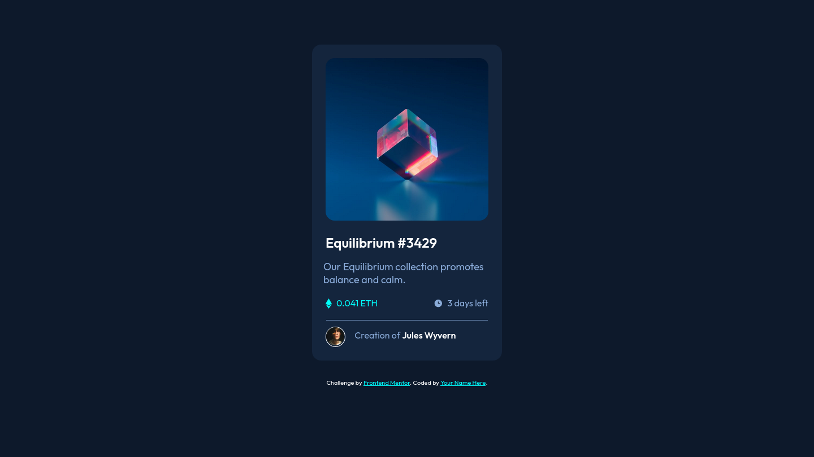

# Frontend Mentor - NFT preview card component solution

This is a solution to the [NFT preview card component challenge on Frontend Mentor](https://www.frontendmentor.io/challenges/nft-preview-card-component-SbdUL_w0U). Frontend Mentor challenges help you improve your coding skills by building realistic projects. 

## Table of contents

- [Overview](#overview)
  - [The challenge](#the-challenge)
  - [Screenshot](#screenshot)
  - [Links](#links)
- [My process](#my-process)
  - [Built with](#built-with)
  - [What I learned](#what-i-learned)
  - [Continued development](#continued-development)
  - [Useful resources](#useful-resources)
- [Author](#author)
- [Acknowledgments](#acknowledgments)


## Overview

I've learned HTML & CSS for two months and now I'm practicing them. this is my second project on the web. I like working with Flexbox & Grid and in this project I focus on using Grid. hope it works well.

### The challenge

Users should be able to:

- View the optimal layout depending on their device's screen size
- See hover states for interactive elements

### Screenshot



### Links

- Solution URL: [My Solution](https://github.com/luciferad/nft-preview-card-component-main)
- Live Site URL: [My Live Site](https://luciferad.github.io/nft-preview-card-component-main/)

## My process

First I wrote the HTML tags. I divided the page into two section, main & footer. Then I put 'div' inside the main section and use Grid to make five grid area for image, text, two seperated icons and footer. after that I style every components seperately.

### Built with

- Semantic HTML5 markup
- CSS custom properties
- Flexbox
- CSS Grid

### What I learned

In this project I learned to use 'role' attribute properly. Roles is useful for working with ARIA. I hope learn more about ARIA in near future.

To see how you can add code snippets, see below:

```html
<main role="main"></main>
<footer role="contentinfo"></footer>
```

### Continued development

I'm a beginner in front-end development. I want to work with html & css for a while.

### Useful resources

- [Learning Web Design](https://www.amazon.com/Learning-Web-Design-Beginners-JavaScript/dp/1491960205) - This book teach me everything for begining. It's a good book for starting frontend development.

## Author

- github - [@luciferad](https://github.com/luciferad/)
- Frontend Mentor - [@luciferad](https://www.frontendmentor.io/profile/luciferad)